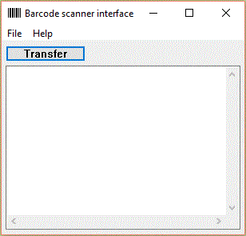

# Opticon EULA

Well I just discovered that Opticon's EULA sucks big time!  It's trying
to claim that any software written to work with their scanner is to be
considered owned by them!

[EULA](http://www.opticonusa.com/downloads/documents/Opticon_End_User_License_Agreement.pdf)

Talk about overreach, especially given that they are using GNU compilers.

# cartscan

This is an item tracking application for the Opticon [OPH-1005](http://www.opticonusa.com/products/handheld-solutions/oph-1005.html)
barcode scanner.  It should also work on the OPH-3001 after a recompile.

The OPH-1005 uses a CRD-1006 cradle with an FTDI USB to serial converted
built-in.  The OPH-3001 has a USB socket built in.

The idea is that there are locations and items.  You scan a location code to
set the current location.  Then you scan one or more item codes to assert
that they are in the current location.  For each item scanned, a record is
created with a time-stamp, the location code and the item code.

The original purpose of this application is to keep track of carts for a
greenhouse operation.  Flowers are shipped to customers on carts, but the
customers are supposed to return the carts (but often don't).  So the
locations include a code for the home location (the greenhouse), a location
code for each customer and an item code for each cart.  When carts are
shipped to customers, they are scanned with the current location set to the
customer.  When they are returned they are also scanned but with the current
location set to home.  With the data collected you can determine which
customers haven't yet returned your carts.

The records are downloaded to a PC and appended to a file
C:\\barcode\\data.txt.  The records are in csv format:

	"2/12/2016 23:12:15","location-code","item-code"

Records from several scanners can all be appended to this same file.  The
most recent record (based on the time stamp) for any given item gives its
last known location.  A separate application (for example MS-Access) can be
used to make nice reports based on the data in this file.

The barcode scanner has a table of known locations.  This table can be
uploaded to the scanner and is usually stored in C:\\barcode\\locations.txt. 
It's also a csv file in this format:

	"location-code","description"

When you scan a location code, the current location is changed and the
description is shown if it's known.  Also you can hit F1, scroll through the
location table and hit the Scan or Enter buttons to select the current
location manually.

## Keys

* 0 - 9:  Allows you to enter an item or location code directly.  As you enter you can use Backspace to help edit.  Hit Scan or Enter when done.  If you entered three digits or less it's treated as if you scanned a location code.  If you entered four digits or more it's treated as if you scanned an item code, except that 'M' is prefixed in front of the code.

* F1: Switch to location selection screen.  Hit up arrow and down arrow to scroll through the known locations.  Hit Scan or Enter to select a new current location.  Hit F1 again to cancel.

* Scan: turn on laser to allow you to scan a barcode.  The laser stays on for a few seconds, then turns off if no barcode was scanned.

* Up arrow, down arrow: allows you to scroll through the scanned items.  The arrow keys have auto-repeat.  Hit Delete to delete one of the items.

## Screen

The main screen shows the current location and the end of the scanned items table:

	current location
	-----------------------------
	mm/dd  location item
	mm/dd  location item
	...

As you type in an item manually, the "current location" is replaced with the
code entered so far.

When you hit F1, the locations table is shown:

	Select location
	-----------------------------
	location description
	location description
	...

## Serial Protocol

* Use 115200 baud, 8 data bits, 1 stop bit, no parity.

* The scanner accepts single line commands, all beginning with "AT".  The command is terminated with linefeed or carriage return.  Each command returns a single line response (the line is terminated with CR-LF).

* ATH: Hello.  Response is "OK".

* ATE: Erase locations table.  Response is "OK".

* ATL"location","description": Add a location to the locations table.  Response is "OK".

* ATDyyyy-mm-dd hh:mm:ss: Set date and time.  Response is "OK".

* ATF: Get first scanned item.  Response is "mm/dd/yyyy hh:mm:ss","location","item" or END if there are no items.

* ATN: Get next scanned item.

* ATX: Erase all scanned items.  Response is "OK".

* Anything else: Response is "Huh?"

## Barcodes

Items begin with any letter, otherwise there is no restriction.  We use code
39, but the scanner will accept many different formats:

	*M1234*

Locations begin with any number, otherwise there is no restriction.  We use
code 39, but the scanner will accept many different formats:

	*123*

## Color

Locations below 10 are treated as "Home" locations.  Locations above "10"
are treated as "away" locations.  When an item is scanned in a home location
it is displayed with green text.  When an item is scanned in an away
location, it is displayed in yellow text.

# Build the Windows application

Install MinGW and add it to the path:

	set path=c:\mingw\bin;$Path

Build with:

	mingw32-make

## Operation

The Windows application is simple: it assumes that the highest numbered
COM port is connected to the scanner.  When you press the Tranfer button, the
application connects to the scanner, updates its date / time, uploads the locations
table from c:\\barcode\\locations.txt and downloads the item database, appending
it to c:\\barcode\\data.txt.

# Build the Opticon OPH-1005 application

Install SDK and be sure to include the OPH-1005 scanner and the Rx compiler. 
Replace the demo.c with the one here and type 'make'.

Turn off scanner.  Hold period, 1 and then hit power.  Select "Application
download".  Use the Appload application from Opticon to download the .hex
file.

The SDK, Appload application and USB drivers for the cradle can be found [here](http://old.opticon.com/opticon-software-download--01000000000018.aspx).
